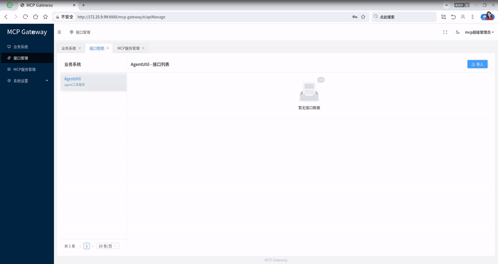

# MCP Gateway

基于 Spring Boot 的 [MCP](https://modelcontextprotocol.io/) 服务网关：将 OpenAPI/Swagger 文档自动转换为 MCP 工具，为大模型提供统一 API 调用能力。



## 特性

- **自动转换**：根据 OpenAPI/Swagger 规范生成 MCP 工具，配置驱动、零侵入
- **标准协议**：支持 MCP `tools/list`、`tools/call`
- **认证**：支持 Bearer Token 等认证方式
- **技术栈**：Spring Boot 3.x、SpringDoc OpenAPI、MCP SDK

## 环境要求

- JDK 17+
- Maven 3.6+
- Node.js 18+
- PostgreSQL 14+

## 快速开始

### 1. Maven 构建（前后端合并打包）

在项目根目录执行（会先构建前端 mcp-gateway-web 再打包进服务端）：

```bash
mvn clean package
```

### 2. 运行

- 启动数据库

```bash
cd docker
docker-compose up -d
```
- 启动服务

```bash
java -jar mcp-gateway-server/target/mcp-gateway-server.jar
```

### 3. 导入 API-Docs 并发布 MCP Server

启动后访问管理端，导入 OpenAPI/Swagger 文档并发布 MCP Server

## 项目结构

```
mcp-gateway/
├── mcp-gateway-server/   # MCP 网关主服务（协议实现、解析器、转换器）
├── mcp-gateway-web/      # MCP 网关 Web 
└── system-base/          # 系统基础模块
```
